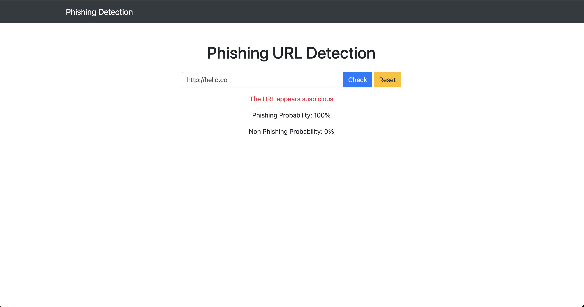

# 🛡️ Phishing Detection  
*Part of a Machine Learning Class Project*

This project aims to detect phishing attacks using a machine learning model, built with the Django Python framework.



---

## 🔧 Setup Instructions

### 1. Create a Virtual Environment
```bash
python3 -m venv .venv
```

### 2. Activate the Virtual Environment
```bash
source .venv/bin/activate
```

### 3. Install Required Packages
Make sure you have a `requirements.txt` file, then run:
```bash
pip install -r requirements.txt
```


### 4. Run the Django Development Server
```bash
python manage.py runserver
```

---

## Notes
- Ensure Python 3.7+ is installed.
- Activate the virtual environment every time before development or running the server.
- Contributions and suggestions are welcome!
